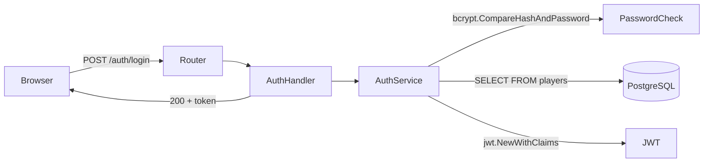

# Claude Code — Project Instructions for Ark8de-L33tBo4rd

This file is read automatically by Claude Code at the start of every session.
These rules apply to ALL code written in this project, no exceptions.

---

## Primary Goal: This is a Go Learning Project

The person working on this project is **learning Go for the first time**.
The goal is not just to produce working code — it is to produce code that teaches.
Correct and clean code that the learner cannot understand is a failure.
Prioritise clarity and explanation over brevity.

---

## Rule 1: Comment Everything That Isn't Obvious

Add comments to:
- Every function and method — what it does, what it receives, what it returns
- Every struct and its fields — what each field represents in the context of the game
- Any line that uses a Go feature that a beginner might not know (defer, goroutines, channels, interfaces, type assertions, etc.)
- Any non-trivial conditional — explain *why* the condition exists, not just what it checks
- Any SQL query — explain what it fetches and why it's structured that way
- Any error handling block — explain what could have gone wrong and why we handle it this way

Do NOT comment things that are truly self-evident (e.g. `i++  // increment i`).
The bar is: "would a developer new to Go understand this without a comment?" If no, comment it.

### Example of what good commenting looks like:

```go
// PlayerRepository handles all database operations for players.
// It is the only layer in the app that is allowed to talk to the database directly —
// all business logic lives in PlayerService instead.
type PlayerRepository struct {
    // db is the connection pool to PostgreSQL. We use pgx which is faster
    // than the standard database/sql driver and has better Postgres-specific features.
    db *pgxpool.Pool
}

// GetByID fetches a single player from the database by their UUID.
// It returns a (Player, nil) on success, or (nil, error) if not found or DB error.
// The context is passed in so the caller can cancel the query if needed
// (e.g. if the HTTP request is cancelled by the client).
func (r *PlayerRepository) GetByID(ctx context.Context, id uuid.UUID) (*Player, error) {
    // QueryRow executes a query expected to return at most one row.
    // $1 is a placeholder for the first argument (id) — this prevents SQL injection.
    row := r.db.QueryRow(ctx, "SELECT id, username, email, role FROM players WHERE id = $1", id)

    var p Player
    // Scan reads the columns from the result row into our struct fields, in order.
    // If the player is not found, row.Scan returns pgx.ErrNoRows.
    if err := row.Scan(&p.ID, &p.Username, &p.Email, &p.Role); err != nil {
        return nil, fmt.Errorf("GetByID: %w", err) // %w wraps the error so callers can unwrap it
    }
    return &p, nil
}
```

---

## Rule 2: Explain Every Import

At the top of every Go file, add a comment block above the `import` statement explaining
what each imported package is and why it's needed in this specific file.
Group standard library, third-party, and internal imports with a blank line between them,
and label each group.

### Example:

```go
import (
    // --- Standard library ---
    "context" // provides Context for cancellation and deadlines — passed into DB queries and HTTP handlers
    "fmt"     // string formatting and error wrapping with fmt.Errorf

    // --- Third-party ---
    "github.com/go-chi/chi/v5"         // HTTP router — we use chi because it is idiomatic and uses standard net/http interfaces
    "github.com/jackc/pgx/v5/pgxpool"  // PostgreSQL driver and connection pool — faster than database/sql for Postgres

    // --- Internal packages ---
    "github.com/Gilibee-goode/ark8de-l33tbo4rd/internal/middleware" // our JWT auth middleware
)
```

---

## Rule 3: Explain Go Concepts Inline When First Used

The first time a Go concept appears in the codebase, add a comment explaining it as a concept,
not just what this specific line does.

Concepts that always need an explanation comment on first use:
- `defer` — explain what defer does and why we use it here
- Interfaces — explain what an interface is and why we define it this way
- Goroutines (`go func()`) — explain what a goroutine is
- Channels — explain what a channel is and how it works
- Struct embedding — explain what embedding means
- Error wrapping with `%w` — explain why we wrap errors
- Pointer receivers vs value receivers — explain the difference on first occurrence
- Type assertions (`x.(Type)`) — explain what this does and when it panics
- `init()` functions — explain when init runs
- Blank identifier `_` in non-obvious contexts

---

## Rule 4: Phase Documentation with Flow Diagrams

At the end of each completed phase, create a markdown documentation file:

**Location**: `docs/phase-N-complete.md`
**Contents**:
1. What was built in this phase (brief summary)
2. A Mermaid diagram showing the flow of information through the app as it stands at the end of this phase
3. A Mermaid diagram of the database schema as it stands
4. Key Go concepts introduced in this phase (with a one-line explanation of each)
5. What the next phase will add

Use Mermaid diagrams — they render natively in GitHub and are written as plain text in markdown.

### Example diagram style:



---

## Rule 5: Code Structure Rules

Always follow the 3-layer pattern within each internal package:

```
handler.go     — HTTP layer only: parse request, call service, write response. No SQL, no business logic.
service.go     — Business logic only: rules, validation, calculations. No HTTP, no SQL.
repository.go  — Database layer only: SQL queries. Returns domain types. No HTTP, no business logic.
```

Add a comment at the top of each file stating which layer it is and what it is allowed to do.

### Example (handler.go top comment):
```go
// Package auth — HTTP Handler layer
//
// This file is ONLY responsible for:
//   - Reading data from the HTTP request (body, headers, URL params)
//   - Calling the AuthService to do the actual work
//   - Writing the HTTP response (status code + JSON body)
//
// It must NOT contain business logic or SQL queries.
// If you find yourself writing an if-statement about game rules here, it belongs in service.go.
```

---

## Rule 6: Error Messages Must Be Human-Readable

Every error message must be understandable without reading the code.
Wrap errors with context at every layer so the full chain is visible in logs.

```go
// Good — tells you exactly where it failed and why
return fmt.Errorf("PlayerService.AllocateSkills: player %s has only %d skill points remaining, need %d: %w",
    playerID, remaining, cost, ErrInsufficientSkillPoints)

// Bad — useless without reading the code
return err
```

---

## Rule 7: Seed Data Must Reflect the Real Game

The seed script must create realistic test data:
- At least 2 full teams of 4 players each
- Players with different class roles (tank, dps, healer, support)
- Some players with gear selected, some without
- One team with a gear pool in the positive, one in the negative (to test the warning display)
- At least one moderator account and one admin account
- Skill nodes seeded for all 4 class roles

Seed credentials must be documented in a comment at the top of `scripts/seed.go`.

---

## Rule 8: Orient Before You Build

Before starting any new task, read **PROGRESS.md** and **ARCHITECTURE.md** to understand:
- What has already been built and what remains
- Where the current work fits in the phased plan
- Which packages, patterns, and conventions are already established

Do not assume you know the state of the project. The codebase evolves across sessions,
and these files are the source of truth for what exists and what's next. If either file
is missing or outdated, flag it before proceeding.

---

## Rule 9: Every Change Gets Tests

All new code must include tests before the work is considered complete:
- **Service-layer business logic** → unit tests with hand-written mocks (see `internal/auth/service_test.go` for the pattern)
- **New endpoints or middleware** → integration tests via `httptest` (see `tests/` directory)
- **Bug fixes** → a test that reproduces the bug before the fix, proving it's resolved

Run the full relevant test suite before declaring a task done:
```bash
# Unit tests (fast, no DB)
cd monolith && go test ./internal/... -v

# Integration tests (needs running PostgreSQL)
cd monolith && go test ./tests/... -v
```

If existing tests break, fix them as part of the same task — never leave the suite red.

---

## Rule 10: Document as You Go, Not After

Each completed segment of work must include:

1. **PROGRESS.md updated** — tick the relevant checkbox, add a brief note if the scope changed
2. **Documentation created or updated** — add to the relevant `docs/phase-N-*.md` file:
   - What was built and why
   - Mermaid diagrams if the architecture or data flow changed
   - A table of new Go concepts introduced (one-line explanation each)
   - What comes next
3. **Code-level documentation** — follows Rules 1–3 (comments on functions, imports, Go concepts)

Documentation is not a follow-up task. It ships with the code. If a phase milestone is
reached (e.g. all Phase 2 checkboxes are done), create the `docs/phase-N-complete.md`
summary per Rule 4.

---

## Reminder: What This Project Is For

This project exists to:
1. Build something genuinely fun and useful (a leaderboard for The Ark8de)
2. Teach Go through doing, not through reading documentation
3. Teach DevOps practices incrementally (Docker → k8s → CI/CD → GitOps → Monitoring)

When in doubt, choose the approach that teaches more, not the one that is faster to write.
