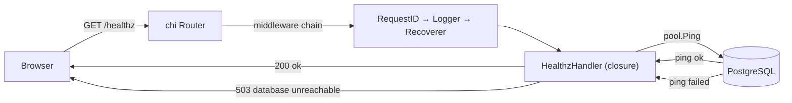

# Phase 0 Complete — Foundation

## What Was Built

Phase 0 establishes the development foundation for the Ark8de leaderboard. No game features yet — this phase is about making the environment reproducible and making the first byte serve over HTTP.

**Deliverables:**
- `.gitignore` — keeps secrets (`.env`) and build artifacts (`bin/`) out of git
- `.env.example` — documents required environment variables without exposing real values
- `Makefile` — one-command developer workflow (`make dev`, `make migrate-up`, etc.)
- `monolith/go.mod` — Go module declaration; pins all dependencies with cryptographic hashes in `go.sum`
- `monolith/internal/db/db.go` — PostgreSQL connection pool (pgxpool)
- `monolith/cmd/server/main.go` — HTTP server with `GET /healthz`, graceful shutdown
- `monolith/cmd/migrate/main.go` — CLI tool to apply/roll back SQL migrations
- `monolith/Dockerfile` — multi-stage build producing a ~10MB Alpine image running as a non-root user
- `infra/docker-compose.yml` — PostgreSQL 16 + pgAdmin + Go app, all wired together
- `db/migrations/` — 11 migration pairs (up + down) defining the full game schema
- `scripts/seed.go` — scaffold with documented test credentials (implementation in Phase 1)

---

## Request Flow: GET /healthz



**Sequence:**
1. Browser sends `GET /healthz`
2. chi assigns a unique `X-Request-Id` header (RequestID middleware)
3. Logger middleware records the start time
4. Recoverer middleware wraps the handler to catch any panics
5. The healthz handler fires a lightweight `pool.Ping()` against PostgreSQL
6. If ping succeeds: respond `200 ok`
7. If ping fails: respond `503 database unreachable`
8. Logger middleware records method, path, status code, and duration

---

## Database Schema (ER Diagram)

```mermaid
erDiagram
    players {
        uuid id PK
        varchar username UK
        varchar email UK
        varchar password_hash
        varchar role
        varchar profile_photo_url
        varchar class_role
        int skill_points_total
        int kredits
        timestamptz created_at
        timestamptz updated_at
    }

    teams {
        uuid id PK
        varchar name UK
        varchar tag UK
        uuid owner_id FK
        varchar logo_url
        int arkade_points
        int gear_points_total
        bool is_locked_in
        timestamptz created_at
        timestamptz updated_at
    }

    team_members {
        uuid team_id PK_FK
        uuid player_id PK_FK
        timestamptz joined_at
    }

    join_requests {
        uuid id PK
        uuid team_id FK
        uuid player_id FK
        varchar status
        timestamptz requested_at
        timestamptz resolved_at
    }

    skills {
        uuid id PK
        varchar name
        text description
        varchar class_role
        int cost_skill_points
        text effect_description
        varchar effect_type
    }

    player_skill_allocations {
        uuid player_id PK_FK
        uuid skill_id PK_FK
        timestamptz allocated_at
    }

    gear_types {
        uuid id PK
        varchar name UK
        int gear_point_cost
    }

    player_gear {
        uuid player_id PK_FK
        uuid gear_type_id PK_FK
        timestamptz selected_at
    }

    kredit_transactions {
        uuid id PK
        uuid from_player_id FK
        uuid to_player_id FK
        int amount
        text note
        uuid created_by FK
        timestamptz created_at
    }

    arkade_point_logs {
        uuid id PK
        uuid team_id FK
        uuid changed_by FK
        int delta
        text reason
        timestamptz created_at
    }

    leaderboard_entries {
        uuid team_id PK_FK
        varchar team_name
        varchar team_tag
        varchar team_logo_url
        int arkade_points
        int rank
        int member_count
        timestamptz last_updated_at
    }

    players ||--o{ teams : "owns"
    players ||--o{ team_members : "belongs to"
    teams ||--o{ team_members : "has"
    players ||--o{ join_requests : "sends"
    teams ||--o{ join_requests : "receives"
    players ||--o{ player_skill_allocations : "has"
    skills ||--o{ player_skill_allocations : "allocated via"
    players ||--o{ player_gear : "equips"
    gear_types ||--o{ player_gear : "equipped via"
    players ||--o{ kredit_transactions : "sends (nullable)"
    players ||--o{ kredit_transactions : "receives"
    teams ||--o{ arkade_point_logs : "has"
    teams ||--|| leaderboard_entries : "cached in"
```

---

## Go Concepts Introduced in Phase 0

| Concept | One-line explanation |
|---|---|
| **package main** | The special package that makes a Go file an executable program; execution starts in `main()` |
| **go.mod / modules** | The project's dependency manifest — declares the module path and all external packages with pinned versions |
| **context.Context** | A value passed through call chains to carry deadlines, cancellations, and request-scoped data |
| **pgxpool** | A connection pool: a set of pre-opened DB connections shared across requests to avoid per-query TCP overhead |
| **goroutines** | Lightweight threads managed by the Go runtime; `go func()` launches one concurrently with the current code |
| **defer** | Schedules a function call to run when the surrounding function returns — used for guaranteed cleanup (close pool, cancel context) |
| **channels** | Typed conduits for passing values between goroutines; `<-ch` blocks until a value arrives |
| **interfaces (http.Handler)** | A contract: any type with a `ServeHTTP(w, r)` method satisfies `http.Handler` — chi router implements this |
| **closures** | Functions that capture variables from their enclosing scope; used for the `/healthz` handler to capture `pool` |
| **error wrapping (%w)** | `fmt.Errorf("context: %w", err)` wraps the original error so callers can inspect it with `errors.Is()` while seeing human-readable context |
| **blank import (_)** | `import _ "pkg"` imports a package solely for its side effects (registering a driver); no functions are called directly |

---

## What Phase 1 Will Add

Phase 1 builds the full game application on this foundation:

1. **Auth** — player registration, login, JWT issuance, 4-tier role middleware
2. **Player profile** — class_role selection, profile photo upload, computed stats (HP, armor, skill points remaining)
3. **Skills system** — seed 16 skills, allocation UI with point budget enforcement
4. **Gear system** — gear selection, team gear pool live display (goes red when negative)
5. **Team management** — create team, join requests workflow, lock-in toggle, logo upload
6. **Kredits** — moderator grant, player-to-player transfer, transaction history
7. **Arkade points** — moderator assigns to teams, audit log
8. **Leaderboard** — ranked team list by Arkade points with roster cards
9. **Frontend** — Go templates + HTMX: leaderboard page, team detail, player profile, moderator panel

At the end of Phase 1, `docker compose up` will serve a fully functional browser application.
