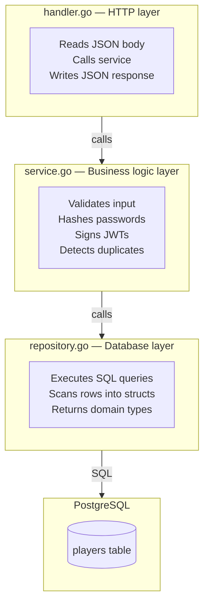

# Phase 1 — Auth (In Progress)

> Phase 1 is being built incrementally. This document captures the state after the **Auth** step is complete. It will be replaced by `phase-1-complete.md` when the full monolith is done.

## What Was Built

The auth system gives players a verified identity. Every future endpoint will rely on the JWT produced here to know who is making a request and what they are allowed to do.

**New files:**
- `monolith/internal/auth/model.go` — `Player` struct, `PlayerResponse` (safe public view), request/response types
- `monolith/internal/auth/repository.go` — SQL layer: `CreatePlayer`, `GetByEmail`, `GetByID`
- `monolith/internal/auth/service.go` — business logic: input validation, bcrypt hashing, JWT signing, duplicate detection
- `monolith/internal/auth/handler.go` — HTTP layer: `POST /auth/register`, `POST /auth/login`, `GET /auth/me`
- `monolith/internal/middleware/auth.go` — `Authenticate` middleware (JWT verification) + `RequireRole` (permission enforcement)
- `monolith/internal/respond/respond.go` — shared `JSON()` and `Error()` response helpers used by all handlers

**New endpoints:**

| Method | Path | Auth required | Description |
|---|---|---|---|
| `POST` | `/auth/register` | No | Create a player account; returns JWT + profile |
| `POST` | `/auth/login` | No | Verify credentials; returns JWT + profile |
| `GET` | `/auth/me` | Yes (Bearer token) | Return the current player's profile |

**Also added:**
- `Taskfile.yml` — replaces Makefile with YAML-based `task` commands
- `infra/pgadmin/servers.json` — pre-registers the postgres server in pgAdmin on every startup
- `JWT_SECRET` added to `docker-compose.yml`, `.env`, and `.env.example`

---

## Request Flow: POST /auth/register

```mermaid
flowchart LR
    Client -->|POST /auth/register\n{username, email, password}| Router["chi Router"]
    Router --> MW["RequestID → Logger → Recoverer"]
    MW --> Handler["AuthHandler.Register"]
    Handler -->|decode JSON body| Handler
    Handler -->|Register req| Service["AuthService.Register"]
    Service -->|validateUsername\nvalidateEmail\nvalidatePassword| Service
    Service -->|bcrypt.GenerateFromPassword| Hash["password hash"]
    Hash --> Service
    Service -->|CreatePlayer| Repo["PlayerRepository"]
    Repo -->|INSERT INTO players RETURNING ...| DB[(PostgreSQL)]
    DB -->|new Player row| Repo
    Repo --> Service
    Service -->|jwt.NewWithClaims\ntoken.SignedString| JWT["signed JWT"]
    JWT --> Service
    Service -->|PlayerResponse + token| Handler
    Handler -->|201 Created\n{token, player}| Client
```

---

## Request Flow: POST /auth/login

```mermaid
flowchart LR
    Client -->|POST /auth/login\n{email, password}| Router["chi Router"]
    Router --> Handler["AuthHandler.Login"]
    Handler -->|Login req| Service["AuthService.Login"]
    Service -->|GetByEmail| Repo["PlayerRepository"]
    Repo -->|SELECT FROM players WHERE email = $1| DB[(PostgreSQL)]
    DB -->|Player row or ErrNoRows| Repo
    Repo --> Service
    Service -->|bcrypt.CompareHashAndPassword| Check{match?}
    Check -->|no match or not found| Service
    Service -->|ErrInvalidCredentials| Handler
    Handler -->|401 Unauthorized| Client
    Check -->|match| Service
    Service -->|generateToken| JWT["signed JWT"]
    JWT --> Service
    Service -->|PlayerResponse + token| Handler
    Handler -->|200 OK\n{token, player}| Client
```

---

## Request Flow: GET /auth/me

```mermaid
flowchart LR
    Client -->|GET /auth/me\nAuthorization: Bearer token| Router["chi Router"]
    Router --> AuthMW["Authenticate middleware"]
    AuthMW -->|parse + verify JWT| AuthMW
    AuthMW -->|invalid/missing token| Client2["Client"]
    Client2 -->|401 Unauthorized| Client2
    AuthMW -->|store playerID + role in context| Handler["AuthHandler.Me"]
    Handler -->|PlayerIDFromContext| Handler
    Handler -->|GetPlayer| Service["AuthService.GetPlayer"]
    Service -->|GetByID| Repo["PlayerRepository"]
    Repo -->|SELECT FROM players WHERE id = $1| DB[(PostgreSQL)]
    DB -->|Player row| Repo
    Repo --> Service
    Service -->|PlayerResponse| Handler
    Handler -->|200 OK\n{player}| Client
```

---

## 3-Layer Architecture

Each feature in the monolith follows the same structure. Auth is the first example:



**Rule:** no layer may skip a layer. A handler never touches SQL. A repository never validates business rules.

---

## JWT Structure

A JWT has three parts separated by dots: `header.payload.signature`

The payload we embed in every token:

```json
{
  "player_id": "550e8400-e29b-41d4-a716-446655440000",
  "role": "player",
  "exp": 1744500000,
  "iat": 1744413600,
  "iss": "ark8de-l33tbo4rd"
}
```

- `player_id` — identifies the player on every subsequent request (no DB lookup needed)
- `role` — lets `RequireRole` middleware enforce permissions without a DB lookup
- `exp` — token expires 24 hours after issuance; client must log in again after that
- `iss` — issuer label, used to verify the token came from this app

---

## Go Concepts Introduced in this Step

| Concept | One-line explanation |
|---|---|
| **Struct methods (receivers)** | `func (p *Player) ToResponse()` — attaches a function to a type; pointer receiver avoids copying the whole struct |
| **Pointer vs value** | `*Player` is a pointer (address of one shared value); `Player` would be a copy — large structs and shared state always use pointers |
| **Sentinel errors** | Named `var ErrEmailTaken = errors.New(...)` — stable error values callers can compare with `errors.Is()` instead of parsing strings |
| **errors.Is / errors.As** | `errors.Is` checks if an error (or any it wraps) matches a target; `errors.As` does the same but for a concrete type |
| **Closures (middleware)** | `Authenticate(secret)` returns a function that captures `secret` — the inner function uses it long after the outer function returned |
| **Context values** | `context.WithValue` stores player ID and role in the request context so downstream handlers can read them without extra DB calls |
| **Type assertions** | `claims, ok := token.Claims.(*jwtClaims)` — safely converts an interface value to a concrete type; two-value form never panics |
| **http.HandlerFunc** | A type adapter that converts a plain `func(w, r)` into an `http.Handler` interface — how chi middleware is written |
| **bcrypt** | A deliberately slow, salted password hash — `GenerateFromPassword` hashes; `CompareHashAndPassword` verifies |
| **json struct tags** | `` `json:"player_id"` `` — tells the JSON encoder/decoder what key name to use in JSON output |
| **map[string]bool as a set** | Go has no built-in set type; `map[string]bool` with `true` values gives O(1) membership checks |

---

## What's Next in Phase 1

1. **Player profile** — `PUT /players/me/class` to set class_role; computed stats endpoint (HP, armor, skill points remaining, gear points used)
2. **Skills system** — seed 16 skills (4 per class), `PUT /players/me/skills` with point budget enforcement
3. **Gear system** — `PUT /players/me/gear` with team gear pool display
4. **Team management** — create team, join requests, lock-in toggle, logo upload
5. **Kredits** — moderator grant, player-to-player transfer, transaction history
6. **Arkade points** — moderator assigns to teams, full audit log
7. **Leaderboard** — ranked team list by Arkade points
8. **Frontend** — Go templates + HTMX: leaderboard, team detail, profile, moderator panel
