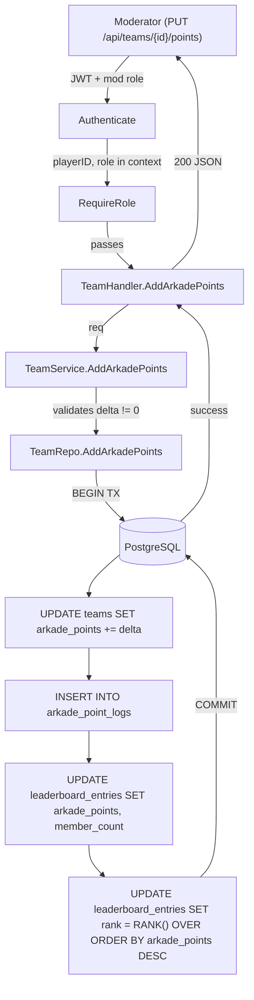
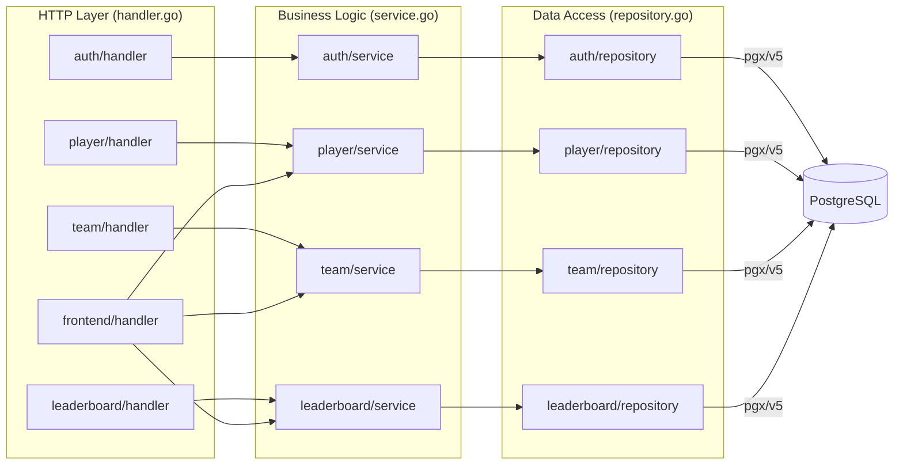

# Phase 1 Complete — Full Monolith

## What Was Built

Phase 1 implements the complete game application on the Phase 0 foundation.
After `task dev && task migrate-up && task seed`, you can open a browser and use the full leaderboard.

**Deliverables:**

| Area | What was built |
|---|---|
| **Auth** | `POST /auth/register`, `POST /auth/login`, `GET /auth/me` — bcrypt password hashing, HS256 JWT (24h), 4-tier role system (player → team_owner → moderator → admin) |
| **Player** | `GET/PUT /api/players/me/class` — class selection (tank/dps/healer/support); `/me/stats` — HP + armor computed from class base + skill bonuses; `/me/skills` + `/me/gear` — allocation with budget enforcement |
| **Kredits** | `GET /api/players/me/kredits` — balance + history; `POST /me/kredits/transfer` — player-to-player transfer; `POST /api/players/{id}/kredits` — moderator grant |
| **Teams** | Full CRUD at `/api/teams`; join request workflow (send → accept/reject); lock-in toggle; gear pool budget tracking; member removal |
| **Arkade Points** | `PUT /api/teams/{id}/points` (mod only) — delta-based, recalculates all ranks via SQL RANK() window function; append-only audit log |
| **Leaderboard** | `GET /api/leaderboard` — pre-computed `leaderboard_entries` cache; ranks updated on every point change |
| **Frontend** | `GET /` leaderboard page, `GET /teams/{id}` team detail, `GET /profile` player profile, `GET /mod` moderator panel — all server-rendered Go templates with dark arcade theme CSS |
| **Seed data** | 11 players (2 full teams + extras), 16 skills seeded, gear selections (Alpha team over budget → red; Beta within budget → green), 5 Arkade point events |

---

## Full Request Flow: GET / (Leaderboard Page)

```mermaid
flowchart LR
    Browser -->|GET /| chiRouter["chi Router"]
    chiRouter -->|middleware| MW["RequestID → Logger → Recoverer"]
    MW --> FE["FrontendHandler.Leaderboard"]
    FE -->|GetLeaderboard| LbSvc["LeaderboardService"]
    LbSvc -->|GetAll| LbRepo["LeaderboardRepository"]
    LbRepo -->|SELECT FROM leaderboard_entries ORDER BY arkade_points DESC| DB[(PostgreSQL)]
    DB -->|[]LeaderboardEntry| LbRepo
    LbRepo --> LbSvc --> FE
    FE -->|template.ParseFiles base.html + leaderboard.html| Templates["html/template"]
    Templates -->|Execute with data| FE
    FE -->|200 HTML| Browser
```

---

## Arkade Points Flow (most complex write path)



---

## 3-Layer Architecture



---

## Database Schema (end of Phase 1)

```mermaid
erDiagram
    players {
        uuid id PK
        varchar username UK
        varchar email UK
        varchar password_hash
        varchar role
        varchar profile_photo_url
        varchar class_role
        int skill_points_total
        timestamptz created_at
        timestamptz updated_at
    }

    skills {
        uuid id PK
        varchar name
        text description
        varchar class_role
        int cost_skill_points
        text effect_description
        varchar effect_type
        int hp_bonus
        int armor_bonus
    }

    player_skill_allocations {
        uuid player_id PK_FK
        uuid skill_id PK_FK
        timestamptz allocated_at
    }

    gear_types {
        uuid id PK
        varchar name UK
        int gear_point_cost
    }

    player_gear {
        uuid player_id PK_FK
        uuid gear_type_id PK_FK
        timestamptz selected_at
    }

    kredit_transactions {
        uuid id PK
        uuid from_player_id FK
        uuid to_player_id FK
        int amount
        text note
        uuid created_by FK
        timestamptz created_at
    }

    teams {
        uuid id PK
        varchar name UK
        varchar tag UK
        uuid owner_id FK
        varchar logo_url
        int arkade_points
        int gear_points_total
        bool is_locked_in
        timestamptz created_at
        timestamptz updated_at
    }

    team_members {
        uuid team_id PK_FK
        uuid player_id PK_FK
        timestamptz joined_at
    }

    join_requests {
        uuid id PK
        uuid team_id FK
        uuid player_id FK
        varchar status
        timestamptz requested_at
        timestamptz resolved_at
    }

    arkade_point_logs {
        uuid id PK
        uuid team_id FK
        uuid changed_by FK
        int delta
        text reason
        timestamptz created_at
    }

    leaderboard_entries {
        uuid team_id PK_FK
        varchar team_name
        varchar team_tag
        varchar team_logo_url
        int arkade_points
        int rank
        int member_count
        timestamptz last_updated_at
    }

    players ||--o{ player_skill_allocations : "allocates"
    skills ||--o{ player_skill_allocations : "used in"
    players ||--o{ player_gear : "equips"
    gear_types ||--o{ player_gear : "equipped via"
    players ||--o{ kredit_transactions : "sends"
    players ||--o{ kredit_transactions : "receives"
    players ||--o{ teams : "owns"
    players ||--o{ team_members : "belongs to"
    teams ||--o{ team_members : "has"
    players ||--o{ join_requests : "sends"
    teams ||--o{ join_requests : "receives"
    teams ||--o{ arkade_point_logs : "logged in"
    teams ||--|| leaderboard_entries : "cached in"
```

---

## Route Map

### Frontend (returns HTML)

| Method | Path | Auth | Description |
|---|---|---|---|
| GET | `/` | none | Leaderboard page |
| GET | `/teams/{id}` | none | Team detail page |
| GET | `/profile` | JWT | Player's own profile page |
| GET | `/mod` | JWT + mod/admin | Moderator action panel |

### Auth API (returns JSON)

| Method | Path | Auth | Description |
|---|---|---|---|
| POST | `/auth/register` | none | Register new player |
| POST | `/auth/login` | none | Login, receive JWT |
| GET | `/auth/me` | JWT | Current player info |

### Leaderboard API

| Method | Path | Auth | Description |
|---|---|---|---|
| GET | `/api/leaderboard` | none | All teams ranked |
| GET | `/api/leaderboard/teams/{id}` | none | One team's card |

### Team API

| Method | Path | Auth | Description |
|---|---|---|---|
| GET | `/api/teams` | none | List all teams |
| POST | `/api/teams` | JWT | Create team |
| GET | `/api/teams/{id}` | none | Get team detail |
| PUT | `/api/teams/{id}` | JWT (owner/admin) | Update team |
| DELETE | `/api/teams/{id}` | JWT (owner/admin) | Delete team |
| PUT | `/api/teams/{id}/lock` | JWT (owner/admin) | Toggle lock-in |
| DELETE | `/api/teams/{id}/members/{pid}` | JWT (owner/admin) | Remove member |
| POST | `/api/teams/{id}/join-requests` | JWT | Send join request |
| GET | `/api/teams/{id}/join-requests` | JWT (owner/admin) | List join requests |
| PUT | `/api/teams/{id}/join-requests/{rid}` | JWT (owner/admin) | Accept or reject |
| PUT | `/api/teams/{id}/points` | JWT (mod/admin) | Add/deduct Arkade points |
| GET | `/api/teams/{id}/points/history` | JWT (mod/admin) | Point audit log |

### Player API

| Method | Path | Auth | Description |
|---|---|---|---|
| GET | `/api/players/{id}` | none | Public player profile |
| PUT | `/api/players/me/class` | JWT | Set class role |
| GET | `/api/players/me/stats` | JWT | Computed combat stats |
| GET | `/api/players/me/skills` | JWT | Allocated skills |
| PUT | `/api/players/me/skills` | JWT | Update skill allocation |
| GET | `/api/players/me/gear` | JWT | Selected gear |
| PUT | `/api/players/me/gear` | JWT | Update gear selection |
| GET | `/api/players/me/kredits` | JWT | Balance + history |
| POST | `/api/players/me/kredits/transfer` | JWT | Transfer to player |
| POST | `/api/players/{id}/kredits` | JWT (mod/admin) | Grant Kredits |
| GET | `/api/skills` | none | All skills (filterable by class) |

---

## Key Go Concepts Introduced in Phase 1

| Concept | Explanation |
|---|---|
| **bcrypt** | One-way password hashing — `bcrypt.GenerateFromPassword` is slow by design to resist brute force |
| **JWT (JSON Web Token)** | Self-contained token: Base64(header).Base64(payload).HMAC-signature — server verifies without a DB lookup |
| **Pointer types (*int, *string)** | A pointer stores a memory address, not a value — used to represent "optional" fields (nil = absent) |
| **Struct embedding** | `type TeamDetailResponse struct { *Team; ... }` — embeds all Team fields directly into TeamDetailResponse |
| **Sentinel errors** | `var ErrTeamNotFound = errors.New(...)` — named errors checked with `errors.Is()` for type-safe error handling |
| **errors.As()** | Extracts the underlying concrete error type (e.g. `*pgconn.PgError`) from a wrapped error chain |
| **DB transactions (pgx)** | `pool.Begin()` → multiple queries → `tx.Commit()` — all succeed or all roll back atomically |
| **SQL RANK() window function** | Computes rank within a result set without grouping — recalculates all team ranks in one UPDATE |
| **Context values** | `context.WithValue(ctx, key, value)` — threads request-scoped data (player ID, role) through the call stack |
| **http.FileServer** | Serves files from the local filesystem — used for `/static/` CSS and images |
| **html/template** | Go's XSS-safe template engine — auto-escapes values inserted into HTML; uses `{{block}}` / `{{define}}` for layouts |
| **template.FuncMap** | Registers custom functions callable from templates — used for `deref` to dereference `*int` pointers |
| **Closures (capture)** | The `Authenticate` middleware returns a function that captures `jwtSecret` — accessible without a parameter |
| **Type assertions (x.(T))** | Extracts the concrete type from an interface — used to read `*jwtClaims` from `jwt.Claims` |

---

## What Phase 2 Will Add

Phase 2 focuses on **testing and CI** to prove the code is correct and prevent regressions:

1. **Unit tests** — service layer functions tested with mock repositories
2. **Integration tests** — HTTP handlers tested with `httptest.NewServer`
3. **DB tests** — real PostgreSQL spun up with `testcontainers-go` for full-stack tests
4. **GitHub Actions** — `go vet`, `go test ./...`, `golangci-lint` on every push
5. **Multi-stage Docker build** — builder image compiles; scratch/alpine image runs (target < 20 MB)
