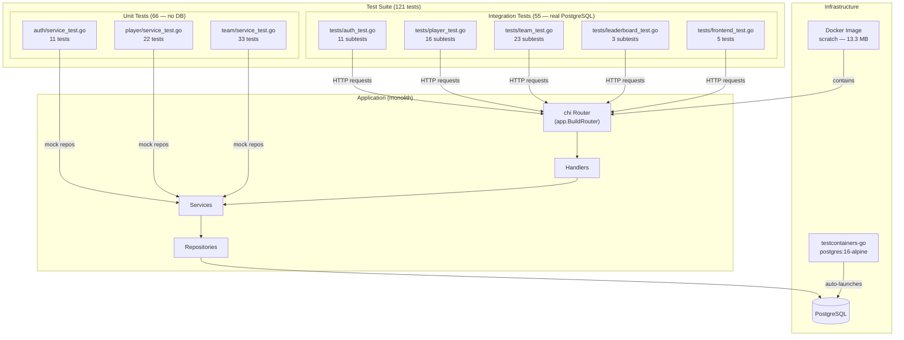
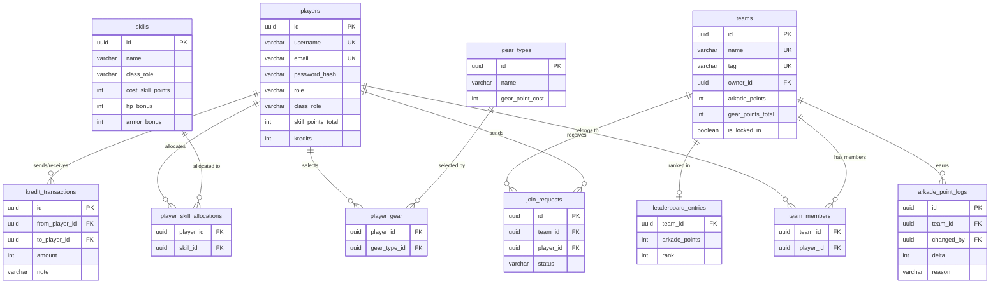
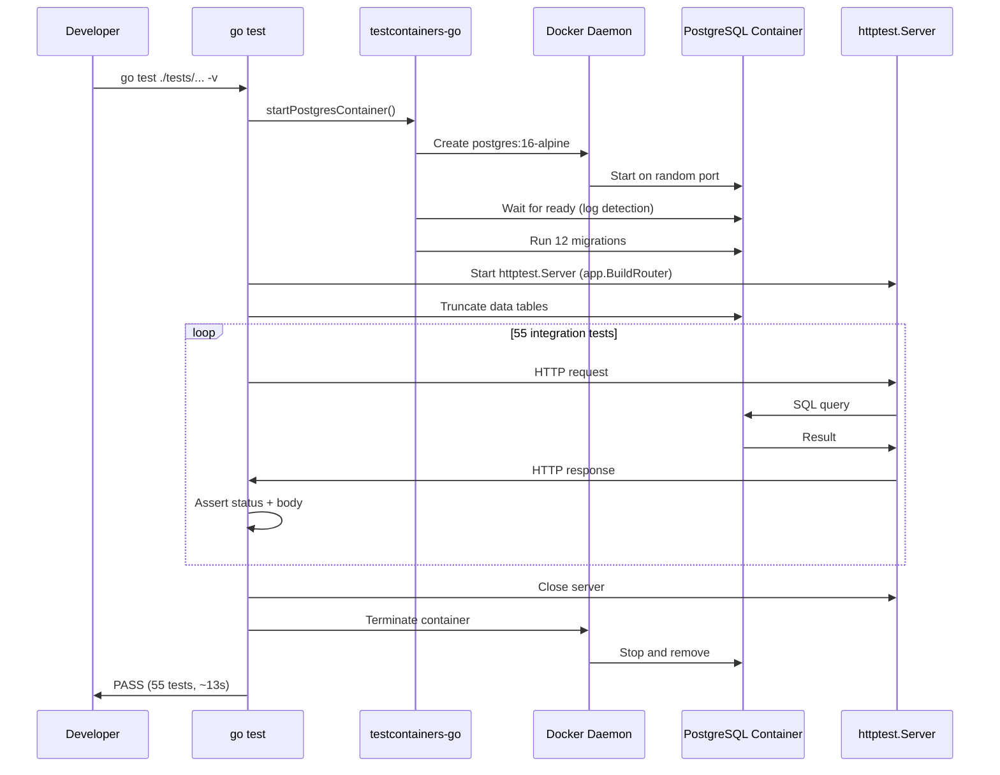

# Phase 2 Complete — Testing, Structured Logging, Docker Optimization

## What Was Built

Phase 2 added a comprehensive test suite, structured logging, and a production-optimized Docker image to the monolith built in Phase 1.

| Deliverable | Details |
|---|---|
| **Integration tests** | 55 tests across 5 files — full HTTP stack with real PostgreSQL |
| **Unit tests** | 66 tests across 3 files — service-layer business logic with hand-written mocks |
| **Testcontainers** | Auto-launches disposable PostgreSQL for tests — zero manual setup |
| **Structured logging** | `log/slog` with JSON output across all handlers and services |
| **Docker optimization** | Scratch-based image: **13.3 MB** (down from 22 MB with Alpine) |
| **Shared router** | `internal/app/router.go` — same router in production and tests |
| **Repository interfaces** | Enables mock injection for unit testing without changing callers |

**Deferred:** GitHub Actions CI pipeline (will be added later).

---

## Architecture After Phase 2

---

## Database Schema (unchanged from Phase 1)

---

## Data Flow: Running Tests

---

## Key Go Concepts Introduced in Phase 2

| Concept | Explanation |
|---|---|
| **`TestMain(m *testing.M)`** | Special entry point that runs before tests — used for one-time setup (DB, server) and teardown |
| **`httptest.NewServer`** | Creates a real HTTP server on a random port for integration testing |
| **Interfaces for testability** | Defining `Repository` interfaces lets tests inject mocks without changing production code |
| **Structural typing** | Go interfaces are satisfied implicitly — no `implements` keyword needed |
| **Function-field mocks** | A struct with `func` fields lets each test control what the mock returns |
| **`var _ Interface = (*Type)(nil)`** | Compile-time check that a concrete type implements an interface |
| **`errors.Is` / `errors.As`** | Check error chains for sentinel errors or extract specific error types |
| **testcontainers-go** | Library that creates real Docker containers from Go test code |
| **`wait.ForLog().WithOccurrence(2)`** | Wait strategy: container is ready when a log message appears N times |
| **Blank imports (`_ "pkg"`)** | Import solely for side effects (e.g. registering a database driver via `init()`) |
| **`log/slog`** | Go's standard structured logger (Go 1.21+) — outputs key-value pairs, not printf strings |
| **`slog.NewJSONHandler`** | Produces JSON log output, ideal for log aggregators (Loki, Datadog, ELK) |
| **`scratch` Docker image** | Empty base image (0 bytes) — only works with statically linked binaries |
| **`-ldflags="-w -s"`** | Strips debug info and symbol table from Go binary, reducing size ~30% |
| **`CGO_ENABLED=0`** | Disables C bindings, producing a fully static binary that runs on any Linux |

---

## Docker Image Optimization

| Technique | Saving |
|---|---|
| Multi-stage build (discard Go toolchain) | ~600 MB |
| `scratch` instead of `alpine:3.20` | ~8 MB |
| Binary stripping (`-ldflags="-w -s"`) | ~5 MB |
| `CGO_ENABLED=0` (static linking) | Enables scratch |
| CA certs copied from builder (not installed) | ~1.5 MB |
| **Final image size** | **13.3 MB** |

---

## What Phase 3 Will Add

Phase 3 is **Service Extraction** — breaking the monolith into independent microservices:

| Component | Description |
|---|---|
| leaderboard-service | First extraction — simplest service (2 endpoints, read-only) |
| auth-service | JWT issuance and validation |
| player-service | Class, skills, gear, kredits |
| team-service | Teams, join requests, Arkade points |
| NATS JetStream | Event bus for inter-service communication |
| api-gateway | Single entry point routing to all services |
