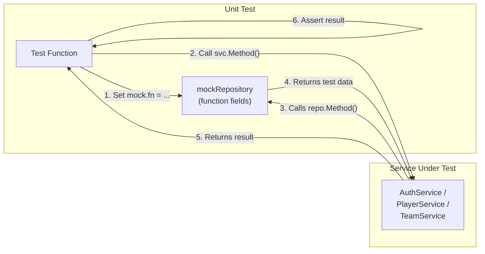
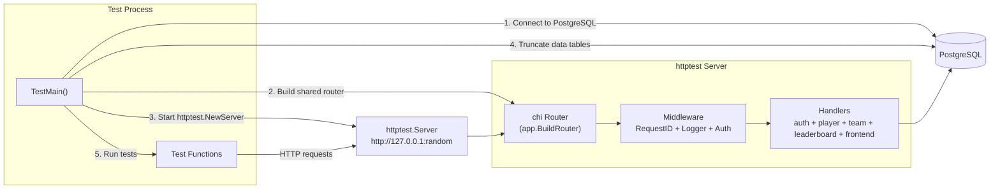

# Phase 2 — Test Suite (Integration + Unit)

## What Was Built

A two-layer test suite covering the entire application:

1. **Integration tests** (55 tests) — exercise every API endpoint and HTML page through the full stack: HTTP request -> chi router -> handler -> service -> repository -> PostgreSQL.
2. **Unit tests** (66 tests) — verify every service-layer business logic function in isolation using hand-written mocks, with no database required.

**121 total test cases** across **8 test files**, all using Go's standard `testing` package — no third-party test frameworks.

---

## Architecture: Two Layers of Testing

### Layer 1: Integration Tests (require PostgreSQL)

Integration tests send real HTTP requests through the full middleware chain to a real
database. They catch bugs that unit tests cannot:

- SQL syntax errors and missing columns
- Transaction isolation issues
- Foreign key constraint violations
- Middleware misconfiguration (wrong route, missing auth)

### Layer 2: Unit Tests (no database needed)

Unit tests verify business logic in isolation by injecting mock repositories. They are
fast (< 2 seconds total), need no infrastructure, and test specific edge cases:

- Input validation (weak password, invalid class role, bad team tag)
- Authorization patterns (owner vs admin vs random player)
- Error mapping (pgconn error codes -> sentinel errors)
- Computation correctness (stat accumulation, skill budget enforcement)
- Race condition guards (accept join request after player joined elsewhere)

### Why Both Layers?

Each layer catches different bugs. Unit tests are fast and precise but can't verify SQL
or middleware. Integration tests are thorough but slow and need a running database.
Together they provide high confidence with fast feedback.

---

## Interface Refactor (Enabling Unit Tests)

To unit test services without a database, we introduced `Repository` interfaces:

```go
// Before: concrete type, can't mock
type PlayerService struct {
    repo *PlayerRepository
}

// After: interface, can inject mocks in tests
type Repository interface {
    GetPublicProfile(ctx context.Context, playerID string) (*PublicPlayerResponse, error)
    UpdateClassRole(ctx context.Context, playerID, classRole string) error
    // ... all methods the service calls
}
type PlayerService struct {
    repo Repository  // interface, not concrete
}
```

Go's **structural typing** means the concrete `*PlayerRepository` satisfies the new
interface automatically — no `implements` keyword, no changes to callers, handlers,
or integration tests. We also added compile-time checks in each `repository.go`:

```go
// This line fails to compile if *PlayerRepository is missing any Repository method.
var _ Repository = (*PlayerRepository)(nil)
```

### Hand-Written Mock Pattern

Each test file defines a `mockRepository` struct with function fields. Tests control
exactly what each mock method returns:

```go
// The mock struct — one function field per interface method
type mockRepository struct {
    createPlayerFn func(ctx context.Context, username, email, hash string) (*Player, error)
    getByEmailFn   func(ctx context.Context, email string) (*Player, error)
    // ...
}

// Each method delegates to its function field
func (m *mockRepository) CreatePlayer(ctx context.Context, u, e, h string) (*Player, error) {
    return m.createPlayerFn(ctx, u, e, h)
}

// In a test, set up only the fields you need:
mock := &mockRepository{
    getByEmailFn: func(ctx context.Context, email string) (*Player, error) {
        return nil, pgx.ErrNoRows  // simulate "email not found"
    },
}
svc := NewAuthService(mock, "jwt-secret")
```



---

## How It Works



### Key Design Choices

| Choice | Why |
|---|---|
| **Shared router** (`internal/app/router.go`) | Tests use the exact same router as production — no hand-assembled imitation that could drift |
| **Real PostgreSQL** (same as docker-compose) | No mocks, no SQLite — tests catch real DB issues |
| **`httptest.NewServer`** | Standard library; starts a real HTTP server on a random port, no Docker needed for the test server itself |
| **Truncate between runs** | `TestMain` clears data tables but preserves reference data (skills, gear_types) |
| **No third-party test libs** | Uses only `testing`, `net/http`, `encoding/json` — no testify, no gomega, nothing to learn beyond Go stdlib |

---

## Shared Router Extraction

The router was extracted from `cmd/server/main.go` into `internal/app/router.go`:

```go
// Before: all wiring was inline in main()
func main() {
    // ... 200 lines of repo → service → handler → route registration
}

// After: main.go calls the shared builder
r := app.BuildRouter(pool, jwtSecret, "templates")
```

Both `cmd/server/main.go` and `tests/setup_test.go` call `app.BuildRouter()` with their
own database pool and JWT secret. This guarantees tests exercise the real middleware chain.

---

## Test Files and Coverage

### `tests/setup_test.go` — Test Infrastructure

| Component | Purpose |
|---|---|
| `TestMain(m *testing.M)` | Connects to DB, builds router, starts httptest server, truncates tables, runs all tests |
| `truncateDataTables()` | Clears players, teams, etc. while preserving skills and gear_types |
| `doRequest(t, method, path, body, token)` | Makes HTTP requests with optional JSON body and JWT auth |
| `parseJSON(t, resp)` / `parseJSONArray(t, resp)` | Reads response body into `map[string]any` or `[]any` |
| `assertStatus(t, resp, code)` | Checks HTTP status code with helpful error message |
| `assertContains(t, haystack, needle)` | Checks string contains substring (for HTML pages) |
| `registerPlayer()` / `loginPlayer()` / `registerAndGetToken()` | Auth convenience helpers used across all test files |

### `tests/auth_test.go` — Authentication (11 subtests)

| Test | What it verifies |
|---|---|
| `TestAuthRegister/success` | 201 + token + player fields |
| `TestAuthRegister/duplicate_email` | 409 Conflict |
| `TestAuthRegister/duplicate_username` | 409 Conflict |
| `TestAuthRegister/weak_password` | 400 Bad Request |
| `TestAuthRegister/missing_fields` | 400 Bad Request |
| `TestAuthLogin/success` | 200 + token |
| `TestAuthLogin/wrong_password` | 401 Unauthorized |
| `TestAuthLogin/email_not_found` | 401 Unauthorized |
| `TestAuthMe/success` | 200 + correct username |
| `TestAuthMe/no_token` | 401 Unauthorized |
| `TestAuthMe/invalid_token` | 401 Unauthorized |

### `tests/player_test.go` — Player Endpoints (16 subtests)

| Test | What it verifies |
|---|---|
| `TestPlayerSetClass` | Set tank, switch to dps, invalid class, no auth |
| `TestPlayerGetStats` | HP/armor/SP returned for a player with a class |
| `TestPlayerSkills` | Allocate valid skills, check budget, wrong class rejection, invalid ID |
| `TestListSkills` | Empty without filter, correct results with `?class_role=tank` |
| `TestPlayerGear` | Select gear, verify points used, reject invalid gear ID |
| `TestPlayerKredits` | Initial balance 0, insufficient transfer, invalid amount, self-transfer rejected |
| `TestPlayerPublicProfile` | Correct fields, no email leaked, 404 for missing player |

### `tests/team_test.go` — Team Endpoints (23 subtests)

| Test | What it verifies |
|---|---|
| `TestTeamCreate` | Success (201), duplicate name (409), duplicate tag (409), invalid tag (400), no auth (401) |
| `TestTeamList` | Returns at least 1 team |
| `TestTeamLifecycle` | Full 16-step workflow: create -> join request -> accept -> detail -> Arkade points -> point history -> forbidden (non-mod) -> update -> lock -> unlock -> remove member -> cannot remove owner -> 404 |
| `TestJoinRequestReject` | Send request -> owner rejects -> member count unchanged |

### `tests/leaderboard_test.go` — Leaderboard (3 subtests)

| Test | What it verifies |
|---|---|
| `TestLeaderboard/full_leaderboard` | Two teams ranked correctly by Arkade points |
| `TestLeaderboard/team_card` | Single team's entry has correct name and points |
| `TestLeaderboard/not_found` | 404 for nonexistent team |

### `tests/frontend_test.go` — HTML Pages + Static Files (5 tests)

| Test | What it verifies |
|---|---|
| `TestFrontendLeaderboard` | GET `/` returns 200, contains "Ark8de" |
| `TestFrontendTeamDetail` | GET `/teams/{id}` renders team name and tag, 404 for missing team |
| `TestHealthz` | GET `/healthz` returns "ok" |
| `TestStaticCSS` | GET `/static/style.css` returns CSS with correct Content-Type |

---

## Key Go Testing Concepts

| Concept | Explanation |
|---|---|
| `TestMain(m *testing.M)` | Special function that runs instead of tests directly — gives you setup/teardown hooks around the entire test suite |
| `httptest.NewServer(handler)` | Creates a real HTTP server on a random port for testing — standard library, no Docker needed |
| `t.Run("name", func(t *testing.T) {...})` | Creates a subtest — subtests group related checks and show up as `TestParent/subtest_name` in output |
| `t.Helper()` | Marks a function as a test helper — when it fails, Go reports the caller's line number, not the helper's |
| `t.Fatalf(format, args...)` | Fails and stops the current test immediately — used when continuing would be meaningless |
| `map[string]any` | Go's generic JSON object — `any` (alias for `interface{}`) holds any type; JSON numbers decode as `float64` |
| `result["field"].(string)` | Type assertion — extracts a concrete type from an `any` value; panics if the type is wrong |
| `-count=1` flag | Disables test result caching — Go caches passing tests by default, which can mask issues |
| **Interfaces for testability** | Defining a `Repository` interface lets tests inject mock implementations without changing production code |
| **Structural typing** | Go interfaces are satisfied implicitly — if a struct has the right methods, it implements the interface automatically |
| **Function-field mocks** | A mock struct with `func` fields lets each test control what the mock returns, without a third-party library |
| **`var _ Interface = (*Type)(nil)`** | Compile-time check that a concrete type satisfies an interface — fails to compile if any method is missing |
| **`errors.Is(err, target)`** | Tests whether an error (or any error in its chain) matches a specific sentinel error |
| **`errors.As(err, &target)`** | Extracts a specific error type from a chain — used to check `*pgconn.PgError` for PostgreSQL error codes |
| **`bcrypt.MinCost`** | Uses minimum bcrypt work factor in tests for speed (~1ms vs ~100ms at DefaultCost) |

---

## Unit Test Files and Coverage

### `internal/auth/service_test.go` — 11 tests

| Test | What it verifies |
|---|---|
| `TestRegister_Success` | Input normalisation (trim whitespace, lowercase email), bcrypt hashing, JWT generation |
| `TestRegister_InvalidUsername_TooShort` | Username under 3 chars rejected |
| `TestRegister_InvalidUsername_BadChars` | Special characters in username rejected |
| `TestRegister_InvalidEmail` | Missing @ rejected |
| `TestRegister_WeakPassword_TooShort` | Under 8 chars rejected |
| `TestRegister_WeakPassword_NoUppercase` | No uppercase letter rejected |
| `TestRegister_DuplicateEmail` | pgconn error 23505 on email constraint -> `ErrEmailTaken` |
| `TestRegister_DuplicateUsername` | pgconn error 23505 on username constraint -> `ErrUsernameTaken` |
| `TestLogin_Success` | Correct password + JWT returned |
| `TestLogin_WrongPassword` | Wrong password -> `ErrInvalidCredentials` (same as not found) |
| `TestLogin_EmailNotFound` | `pgx.ErrNoRows` -> `ErrInvalidCredentials` (no email enumeration) |

### `internal/player/service_test.go` — 22 tests

| Test | What it verifies |
|---|---|
| `TestSetClass_ValidRole` | All 4 valid roles accepted |
| `TestSetClass_InvalidRole` | "wizard" rejected with `ErrInvalidClassRole` |
| `TestGetStats_NoClassSet` | Nil class -> zeroed HP/armor/SP |
| `TestGetStats_WithSkillsAndGear` | Tank base (150 HP, 30 armor) + skill bonuses + gear point accumulation |
| `TestSetSkills_Success` | Valid skills saved |
| `TestSetSkills_NoClassSet` | Can't allocate skills without a class |
| `TestSetSkills_SkillNotFound` | Missing skill ID -> `ErrSkillNotFound` |
| `TestSetSkills_WrongClass` | Tank skill for DPS player -> `ErrSkillWrongClass` |
| `TestSetSkills_BudgetExceeded` | Cost exceeds points -> `ErrInsufficientSkillPts` |
| `TestSetSkills_EmptyListClearsAllocation` | Empty list clears all skills |
| `TestSetGear_Success` | Valid gear saved |
| `TestSetGear_GearNotFound` | Missing gear ID -> `ErrGearNotFound` |
| `TestTransferKredits_Success` | Valid transfer between two players |
| `TestTransferKredits_SelfTransfer` | Self-transfer -> `ErrCannotTransferToSelf` |
| `TestTransferKredits_ZeroAmount` | Zero amount -> `ErrInvalidAmount` |
| `TestTransferKredits_RecipientNotFound` | Non-existent player -> `ErrPlayerNotFound` |
| `TestTransferKredits_InsufficientBalance` | pgconn error 23514 -> `ErrInsufficientKredits` |
| `TestGrantKredits_Success` | Valid moderator grant |
| `TestGrantKredits_ZeroAmount` | Zero amount -> `ErrInvalidAmount` |
| `TestGrantKredits_PlayerNotFound` | Non-existent player -> `ErrPlayerNotFound` |
| `TestGetAvailableSkills_ValidClass` | Returns skills for requested class |
| `TestGetAvailableSkills_InvalidClass` | "wizard" -> `ErrInvalidClassRole` |

### `internal/team/service_test.go` — 33 tests

| Test | What it verifies |
|---|---|
| `TestCreateTeam_Success` | Name trimmed, tag uppercased |
| `TestCreateTeam_NameTooShort` | Under 3 chars -> `ErrInvalidTeamName` |
| `TestCreateTeam_InvalidTag` | Under 2 chars -> `ErrInvalidTag` |
| `TestCreateTeam_TagWithSpecialChars` | Special chars -> `ErrInvalidTag` |
| `TestCreateTeam_DuplicateName` | Constraint violation -> `ErrTeamNameTaken` |
| `TestCreateTeam_DuplicateTag` | Constraint violation -> `ErrTagTaken` |
| `TestUpdateTeam_OwnerSuccess` | Owner can update their team |
| `TestUpdateTeam_AdminSuccess` | Admin can update any team |
| `TestUpdateTeam_Forbidden` | Random player -> `ErrForbidden` |
| `TestUpdateTeam_NotFound` | Missing team -> `ErrTeamNotFound` |
| `TestDeleteTeam_OwnerSuccess` | Owner can delete their team |
| `TestDeleteTeam_Forbidden` | Non-owner -> `ErrForbidden` |
| `TestToggleLock_OwnerSuccess` | Toggle returns new lock state |
| `TestToggleLock_Forbidden` | Non-owner -> `ErrForbidden` |
| `TestRemoveMember_Success` | Owner removes member |
| `TestRemoveMember_CannotRemoveOwner` | Owner can't remove themselves |
| `TestRemoveMember_Forbidden` | Non-owner -> `ErrForbidden` |
| `TestSendJoinRequest_Success` | Valid request created |
| `TestSendJoinRequest_TeamLocked` | Locked team -> `ErrTeamLocked` |
| `TestSendJoinRequest_AlreadyMember` | Already on a team -> `ErrAlreadyInTeam` |
| `TestSendJoinRequest_AlreadyRequested` | Duplicate request -> `ErrAlreadyRequested` |
| `TestResolveJoinRequest_AcceptSuccess` | Accept calls `AcceptJoinRequest` |
| `TestResolveJoinRequest_RejectSuccess` | Reject calls `RejectJoinRequest` |
| `TestResolveJoinRequest_InvalidAction` | "maybe" -> `ErrInvalidAction` |
| `TestResolveJoinRequest_Forbidden` | Non-owner -> `ErrForbidden` |
| `TestResolveJoinRequest_NotPending` | Already resolved -> `ErrRequestNotPending` |
| `TestResolveJoinRequest_AcceptRaceGuard` | Player joined elsewhere -> auto-reject |
| `TestAddArkadePoints_Success` | Valid point adjustment |
| `TestAddArkadePoints_ZeroDelta` | Zero delta -> `ErrInvalidDelta` |
| `TestAddArkadePoints_TeamNotFound` | Missing team -> `ErrTeamNotFound` |
| `TestGetJoinRequests_OwnerSuccess` | Owner can view requests |
| `TestGetJoinRequests_Forbidden` | Non-owner -> `ErrForbidden` |
| `TestListTeams_ReturnsEmptySlice` | Nil from repo -> empty slice (JSON `[]` not `null`) |

---

## How to Run

### Unit Tests (no database needed)

```bash
cd monolith

# All unit tests (~2 seconds)
go test ./internal/auth/... ./internal/player/... ./internal/team/... -v

# Just one package
go test ./internal/auth/... -v
go test ./internal/player/... -v
go test ./internal/team/... -v
```

### Integration Tests (requires PostgreSQL)

```bash
# 1. Start the database (if not already running)
task dev

# 2. Apply migrations (if not already applied)
task migrate-up

# 3. Run the integration suite
cd monolith && go test ./tests/... -v
```

### All Tests Together

```bash
# Unit tests only (fast, no DB)
cd monolith && go test ./internal/... -v

# Integration tests only (needs DB)
cd monolith && go test ./tests/... -v
```

---

## What's Next

The remaining Phase 2 items:

| Item | Status |
|---|---|
| Integration tests with `httptest` | Done |
| Shared router extraction | Done |
| Unit tests with mock repositories | Done (66 tests) |
| `testcontainers-go` for isolated DB tests | Not started |
| GitHub Actions CI pipeline | Not started |
| Structured `log/slog` throughout | Not started |
| Multi-stage Docker build < 20 MB | Already done (Phase 1 Dockerfile) |
