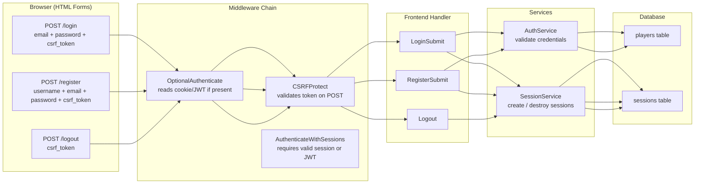
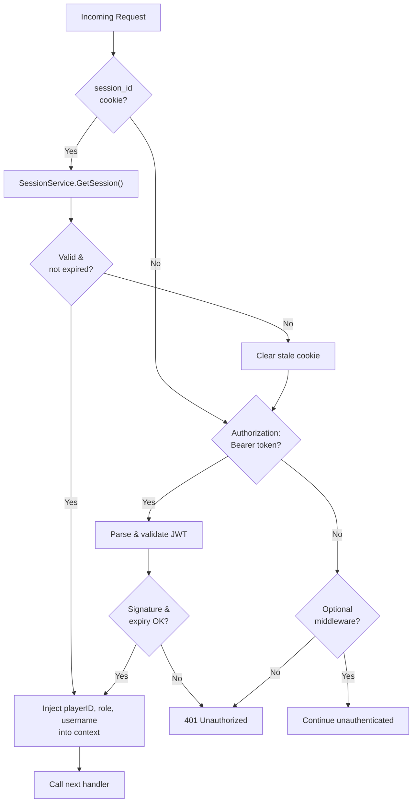
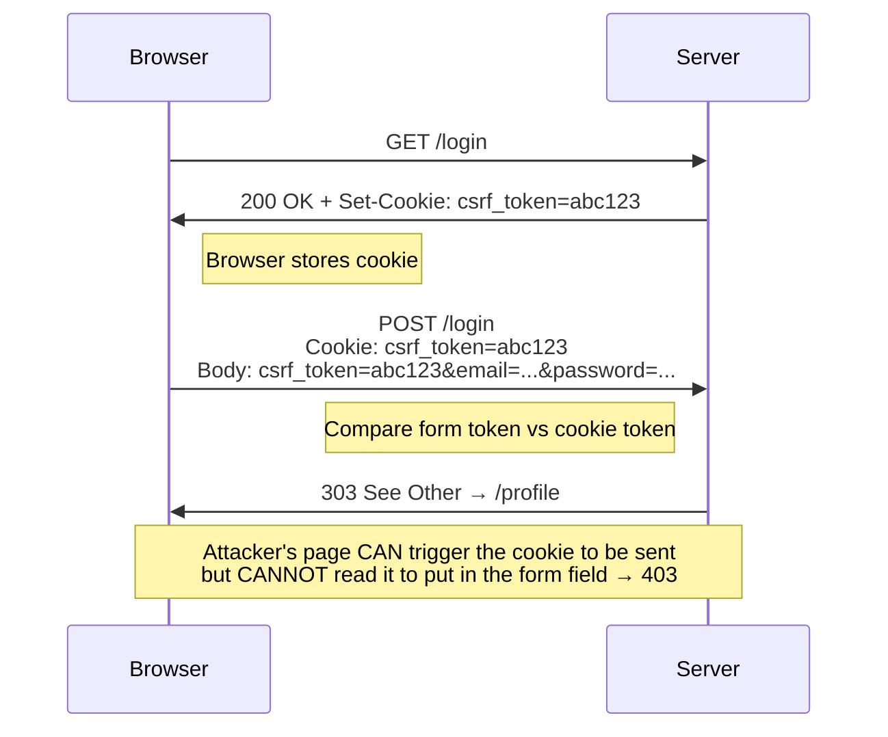
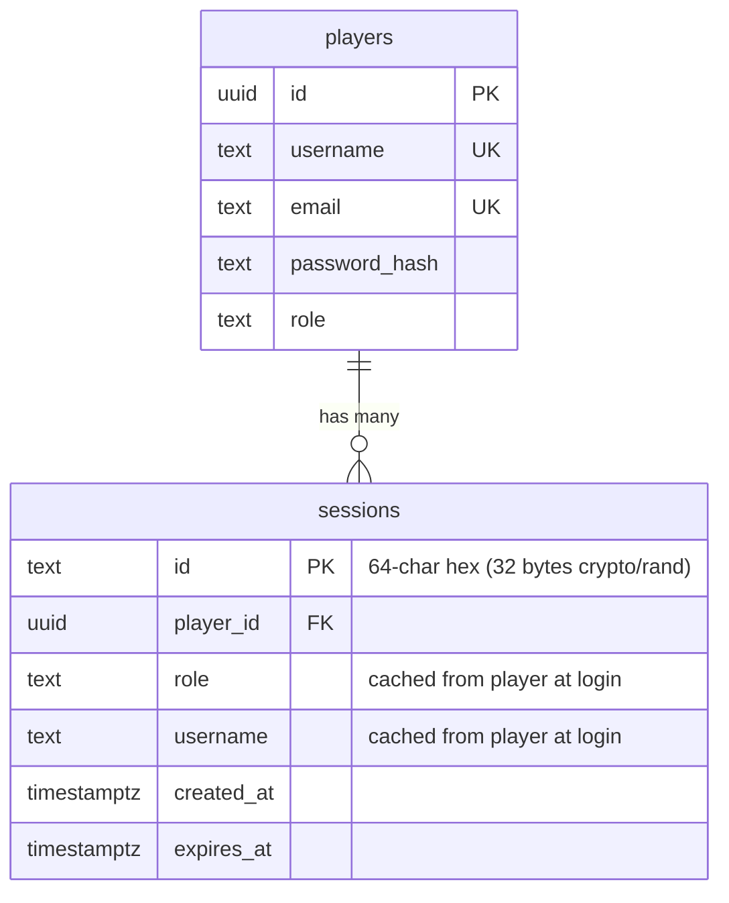

# Phase 2.5 Complete — GUI Login & Session System

## What Was Built

Phase 2.5 replaced the "curl-only" authentication experience with a complete browser-based login system. Players can now register, log in, and log out entirely through the browser — no terminal needed.

| Deliverable | Details |
|---|---|
| **Server-side sessions** | PostgreSQL-backed sessions with 7-day expiry, instant revocation on logout |
| **Cookie-based auth** | HttpOnly session cookie + dual middleware (cookie-first, JWT fallback) |
| **CSRF protection** | Double-submit cookie pattern — form token must match cookie value |
| **Flash messages** | One-time notifications via short-lived cookie (10s MaxAge) |
| **Login/Register pages** | HTML form-based auth with server-side validation |
| **Navbar awareness** | All pages show username + logout when logged in, login/register when not |
| **Moderator panel** | Migrated from JavaScript fetch() to HTML forms with CSRF |
| **Session tests** | 8 unit tests (mock repo) + 15 integration tests (real DB + cookie jar) |
| **Backward compatibility** | All 55 pre-existing integration tests still pass — Bearer JWT unchanged |

---

## Architecture After Phase 2.5

### Authentication Flow

### Dual Authentication (Cookie + JWT)

### CSRF Double-Submit Cookie Pattern

---

## Database Schema (Sessions Table)

---

## New Files

| File | Layer | Purpose |
|---|---|---|
| `db/migrations/000013_create_sessions.{up,down}.sql` | Database | Session table schema |
| `internal/session/model.go` | Model | Session struct, sentinel errors, constants |
| `internal/session/repository.go` | Repository | CRUD operations for sessions table |
| `internal/session/service.go` | Service | Business logic: create, validate, destroy sessions |
| `internal/session/service_test.go` | Test | 8 unit tests with mock repository |
| `internal/middleware/csrf.go` | Middleware | CSRF double-submit cookie validation |
| `internal/middleware/flash.go` | Middleware | One-time flash message cookies |
| `templates/login.html` | Template | Login form page |
| `templates/register.html` | Template | Registration form page |
| `tests/session_test.go` | Test | 15 integration tests for login/session/CSRF |

## Modified Files

| File | What Changed |
|---|---|
| `internal/middleware/auth.go` | Added `AuthenticateWithSessions`, `OptionalAuthenticateWithSessions`, `UsernameFromContext` |
| `internal/app/router.go` | Session wiring, new frontend routes, CSRF middleware on HTML routes |
| `internal/frontend/handler.go` | `PageContext`, `render()` rework, login/register/logout/moderator form handlers |
| `templates/layout/base.html` | Navbar conditional (logged-in/out), flash message area |
| `templates/moderator.html` | Replaced JavaScript with HTML forms + CSRF tokens |
| `templates/team-detail.html` | Template references changed from `.Field` to `.Detail.Field` |
| `static/style.css` | Flash, auth-card, nav-user, btn-logout, btn-outline styles |
| `tests/setup_test.go` | Added `sessions` to truncated tables list |

---

## Go Concepts Introduced in Phase 2.5

| Concept | Where | Explanation |
|---|---|---|
| `crypto/rand` | session/service.go, middleware/csrf.go | Cryptographically secure random bytes for session IDs and CSRF tokens |
| `encoding/hex` | session/service.go | Converts random bytes to a hex string (32 bytes → 64 chars) |
| `encoding/base64` | middleware/flash.go | Encodes JSON flash messages for safe cookie transport |
| `http.Cookie` | Multiple files | Go's struct for setting/reading browser cookies (Name, Value, MaxAge, HttpOnly, SameSite) |
| `cookiejar.Jar` | tests/session_test.go | In-memory cookie store that simulates browser cookie behaviour in tests |
| `http.Client.CheckRedirect` | tests/session_test.go | Controls redirect-following behaviour — returning `http.ErrUseLastResponse` stops the client |
| `url.Values` | tests/session_test.go | Encodes form data as `key=value&key=value` (same as HTML form POST) |
| Interface embedding | frontend/handler.go | `contextSetter` interface lets `render()` inject `PageContext` into any page data struct |
| Sentinel errors | session/model.go | `ErrSessionNotFound`, `ErrSessionExpired` — named errors checked with `errors.Is()` |
| Closure captures | middleware/auth.go | `jwtSecret` and `sessionSvc` captured in middleware closures, available in inner handlers |

---

## Test Coverage

### Unit Tests (8 new — session package)

| Test | What It Verifies |
|---|---|
| `TestCreateSession_Success` | Generates 64-char hex ID, sets 7-day expiry, calls repo.Create |
| `TestCreateSession_RepoError` | Propagates database errors |
| `TestGetSession_ValidSession` | Returns session when not expired |
| `TestGetSession_ExpiredSession` | Returns `ErrSessionExpired`, calls Delete for cleanup |
| `TestGetSession_NotFound` | Returns `ErrSessionNotFound` |
| `TestDestroySession_Success` | Delegates to repo.Delete with correct ID |
| `TestDestroyAllSessions_Success` | Delegates to repo.DeleteByPlayerID |
| `TestCleanExpired_Success` | Calls repo.DeleteExpired |

### Integration Tests (15 new — full HTTP stack)

| Test | What It Verifies |
|---|---|
| `TestLoginPage_Renders` | GET /login returns 200 with form and CSRF field |
| `TestRegisterPage_Renders` | GET /register returns 200 with form and CSRF field |
| `TestRegisterSubmit_Success` | POST /register → 303 to /profile, session cookie set |
| `TestRegisterSubmit_PasswordMismatch` | POST with mismatched passwords → 303 back to /register |
| `TestLoginSubmit_Success` | POST /login → 303 to /profile, session cookie set |
| `TestLoginSubmit_BadPassword` | Wrong password → 303 back to /login, no session cookie |
| `TestLoginSubmit_NonexistentEmail` | Unknown email → 303 back to /login |
| `TestLogout_ClearsSession` | POST /logout → 303 to /, session cookie cleared |
| `TestCSRF_MissingToken_Returns403` | POST without CSRF token → 403 Forbidden |
| `TestCSRF_WrongToken_Returns403` | POST with wrong CSRF token → 403 Forbidden |
| `TestProfile_RequiresAuth` | GET /profile without session → 401 |
| `TestProfile_WorksWithSessionCookie` | GET /profile with session cookie → 200 with username |
| `TestNavbar_LoggedOut_ShowsLoginLink` | Public page without session shows /login and /register links |
| `TestNavbar_LoggedIn_ShowsUsername` | Public page with session shows username and /logout |
| `TestLoginPage_RedirectsWhenLoggedIn` | GET /login while authenticated → 303 to /profile |

---

## What's Next

Phase 3 will extract the monolith into microservices:
- Separate auth, player, team, and leaderboard services
- API gateway for routing
- NATS JetStream for async events between services
