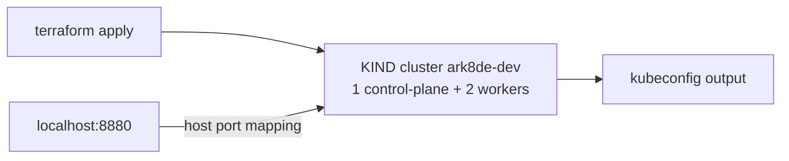

# Phase 4 Complete: Terraform + KIND

## What was built

Terraform now provisions the dev Kubernetes cluster — a local KIND cluster managed declaratively via the `tehcyx/kind` provider.

```
infra/terraform/
  modules/cluster/          # provider-agnostic cluster module (dev impl = KIND)
    main.tf                 # kind_cluster resource, ingress port mappings, worker nodes
    variables.tf            # name, node_image, worker_count, ingress ports
    outputs.tf              # name, endpoint, kubeconfig(_path)
  environments/dev/
    main.tf                 # module call; TF Cloud backend stubbed (commented)
    variables.tf            # cluster_name=ark8de-dev, k8s v1.31.0, 2 workers
    outputs.tf
  .gitignore                # tfstate, .terraform/, tfvars never committed
```

Cluster shape: 1 control-plane (labelled `ingress-ready=true`, host ports **8880→80** and **8443→443** mapped for ingress) + 2 workers.



## Deviations from the original plan

- **Terraform Cloud remote state**: requires an account + `terraform login`; the `cloud {}` block is written and commented in `environments/dev/main.tf` — uncomment after logging in. State is local until then.
- **`infra.yml` GitHub Actions workflow**: skipped (GitHub Actions excluded from this pass).

## Verified

```
terraform init && terraform apply   # 1 resource added, ~50s
kubectl get nodes --context kind-ark8de-dev
  ark8de-dev-control-plane   Ready
  ark8de-dev-worker          Ready
  ark8de-dev-worker2         Ready
```

## Next phase

Phase 5 deploys the six services onto this cluster with Helm-managed Postgres/NATS/ingress-nginx.
